## Table of Contents

- [Introduction](#introduction)
- [Understanding the Presentational-Container Pattern](#understanding-the-presentational-container-pattern)
- [Implementing Container Components](#implementing-container-components)
- [Building Presentational Components](#building-presentational-components)
- [Practical Examples](#practical-examples)
- [Best Practices and Patterns](#best-practices-and-patterns)
- [Migration from MVVM](#migration-from-mvvm)
#### Introduction
MVVM in SwiftUI separates complex logic from views by introducing a **ViewModel** layer—an idea that works well in theory. But SwiftUI’s declarative nature doesn’t align cleanly with MVVM’s imperative patterns. This leads to a subtle yet constant tug-of-war:

> Should UI-related state like `isLoading` or `isAlertShown` live in the **View** or the **ViewModel**?

Consider this common scenario:
```swift
struct ContentView: View {
    @State private var isLoading = false
    @StateObject private var viewModel = ViewModel()
    
    var body: some View {
        if isLoading {
            ProgressView()
        } else {
            Text("Loaded!")
        }
    }
}

final class ViewModel: ObservableObject {
    func onAppear() {
        // Can’t directly change `isLoading` in the view.
    }
}
```
This disconnect forces workarounds that break SwiftUI's elegant reactive flow.
### Enter: the Presentational-Container Pattern

This pattern embraces SwiftUI’s strengths while clearly separating UI from logic. It cleanly splits your code into two parts:

- **Containers**: Handle state, business logic, and data loading.
    
- **Presentational Components**: Stateless UI focused on layout and user interaction.

It offers the clarity of MVVM without the friction.
#### Building Presentational Components

Presentational components are pure SwiftUI—clean, readable, and stateless. 
The key principle is simple: **presentational components never own state**. They declare what they need and trust that containers will provide it.
```swift
struct FeedView: View {
    let isLoading: Bool
    let feeds: [Feed]
    let onAppear: () -> Void
    let onPressFeed: (Feed) -> Void
    let onRefresh: () -> Void

    var body: some View {
        ZStack {
            if isLoading {
                ProgressView("Loading...")
            } else {
                List(feeds) { feed in
                    FeedRowView(feed: feed, onTap: { onPressFeed(feed) })
                }
                .refreshable(action: onRefresh)
            }
        }
        .onAppear(perform: onAppear)
    }
}
```
Presentational views are:
✅ Stateless  
✅ Easily previewable  
✅ Reusable across use cases  
✅ Simple to test

As your feature grows—e.g., adding error messages or pagination—you just extend the parameter list:
```swift
struct FeedView: View {
    let isLoading: Bool
    let feeds: [Feed]
    let errorMessage: String?
    let hasMoreContent: Bool
    // ...
}
```

This approach makes components incredibly reusable and testable—they work the same way regardless of whether data comes from an API, local database, or mock objects.

#### Implementing Container Components

Container components hold everything that presentational views shouldn't:

- **@State / @StateObject** for state management
    
- **Business logic** like filtering or validation
    
- **Side effects** like network requests or navigation
    
- **Callbacks** to handle interactions

Here's how we structure a typical container component:

```swift
struct FeedContainerView: View {
    @ObservedObject var router: Router
    @StateObject private var feedService = FeedService()

    @State private var isLoading = false
    @State private var feeds: [Feed] = []
    @State private var errorMessage: String?

    var body: some View {
        FeedView(
            isLoading: isLoading,
            feeds: feeds,
            errorMessage: errorMessage,
            onAppear: loadInitialFeeds,
            onPressFeed: handleFeedSelection,
            onRefresh: refreshFeeds,
            onRetry: loadInitialFeeds
        )
    }

    private func loadInitialFeeds() {
        Task { await loadFeeds() }
    }

    private func refreshFeeds() {
        Task { await loadFeeds(isRefresh: true) }
    }

    private func loadFeeds(isRefresh: Bool = false) async {
        guard !isLoading else { return }
        isLoading = true
        errorMessage = nil

        do {
            feeds = try await feedService.fetchFeeds()
        } catch {
            errorMessage = "Failed to load feeds: \(error.localizedDescription)"
        }

        isLoading = false
    }

    private func handleFeedSelection(_ feed: Feed) {
        router.push(.feedDetail(feed))
    }
}
```
### 🔄 From MVVM to Containers

The Presentational-Container pattern doesn’t replace MVVM—it **builds on it**.

**Traditional MVVM Structure**:

```
View ↔ ViewModel ↔ Model
```

**Enhanced with Container**:

```
Container ↔ ViewModel ↔ Model
    ↓
Presentational Component
```

The ViewModel still handles business rules, but the **Container** becomes the SwiftUI-native mediator that:

- Maps ViewModel data to props
    
- Owns transient UI state (`@State`)
    
- Manages lifecycle events and side effects

**Here's how it works in practice**:

swift

```swift
class FeedViewModel: ObservableObject {
    @Published var isLoading = false
    @Published var feeds: [Feed] = []
    @Published var errorMessage: String?
    
    func loadFeeds() async { /* business logic */ }
    func refreshFeeds() async { /* business logic */ }
}
```

```swift
struct FeedContainer: View {
    @ObservedObject var router: Router
    @StateObject private var viewModel = FeedViewModel()
    @State private var selectedFeed: Feed?

    var body: some View {
        FeedView(
            isLoading: viewModel.isLoading,
            feeds: viewModel.feeds,
            errorMessage: viewModel.errorMessage,
            onAppear: { Task { await viewModel.loadFeeds() } },
            onPressFeed: handleFeedSelection,
            onRefresh: { Task { await viewModel.refreshFeeds() } },
            onRetry: { Task { await viewModel.loadFeeds() } }
        )
    }

    private func handleFeedSelection(_ feed: Feed) {
        selectedFeed = feed
        router.push(.feedDetail(feed))
    }
}
```

A real-world SwiftUI app using the Container/Presentational pattern might look like this: each feature has a container that connects business logic to a stateless UI, with navigation managed by a router and shared services handling the data layer.

```mermaid
graph TD
    %% Main App Container
    Router[Router<br/>] -.-> FeedContainer[FeedContainer<br/>]
    Router -.-> FeedDetailContainer[FeedDetailContainer<br/>]

    %% Feed Feature
    FeedContainer --> FeedView[FeedView<br/>📱 List UI]
    FeedContainer --> FeedViewModel[FeedViewModel<br/>🧠 Business Logic]

    FeedDetailContainer --> FeedDetailView[FeedDetailView<br/>]
    
    %% ViewModels connect to Services
    FeedViewModel --> FeedService[FeedService<br/>🔧 Data Layer]

    %% Data Flow Arrows
    FeedContainer -.->|props| FeedView
    FeedDetailContainer -.->|props| FeedDetailView
    
    FeedContainer -.-> AppContainer
    FeedDetailContainer -.-> AppContainer
    
    %% Styling
    classDef container fill:#e1f5fe,stroke:#0277bd,stroke-width:3px
    classDef presenter fill:#f3e5f5,stroke:#7b1fa2,stroke-width:2px
    classDef viewmodel fill:#fff3e0,stroke:#f57c00,stroke-width:2px
    classDef service fill:#e8f5e8,stroke:#388e3c,stroke-width:2px
    classDef shared fill:#fce4ec,stroke:#c2185b,stroke-width:2px
    
    
    class FeedContainer,FeedDetailContainer container
    class FeedView,FeedDetailView presenter
    class FeedViewMode viewmodel
    class FeedService service
```


#### Summary
**What the Container does**
- **Transforms** business state into UI-ready props
    
- **Manages** SwiftUI-specific state (alerts, navigation, etc.)
    
- **Prepares** props for the presentational view

**Why it works well**
- Separates business logic from UI concerns
    
- Makes UI components pure and reusable
    
- Simplifies testing and debugging

Think of the Container as a **smart adapter**, bridging your business logic and clean UI.