<a href="https://leochentw.substack.com/p/bringing-containerpresentational">Substack post</a>

## Table of Contents

- [Introduction](#introduction)
- [Understanding the Presentational-Container Pattern](#understanding-the-presentational-container-pattern)
- [Building Presentational Components](#building-presentational-components)
- [Implementing Container Components](#implementing-container-components)
- [Summary](#summary)
#### Introduction

Ever tried updating `@State` from a ViewModel in SwiftUI, only to hit a wall? You’re not alone. MVVM promises separation of concerns and improved testability—but its imperative nature often clashes with SwiftUI’s declarative design. The result? Awkward workarounds, fragile code, and mounting frustration.

As one popular [Apple Developer Forums thread](https://developer.apple.com/forums/thread/699003) puts it: forcing MVVM onto SwiftUI is like "**taking the magic power from SwiftUI.**" Instead of embracing the framework’s strengths, you're constantly fighting against them.

Take this common scenario:
```swift
struct ContentView: View {
	@Environment(\.dismiss) var dismiss
    @State var isLoading = false
    @StateObject var viewModel = ViewModel()
    
    var body: some View {
        if isLoading {
            ProgressView()
        } else {
            Text("Loaded!")
        }
    }
}

final class ViewModel: ObservableObject {
    func onAppear() { 
	    // Can’t directly change `isLoading` in the view.
    }
	func onPressCancel() { 
		// Can’t directly call `dismiss` in the view.
	}
}
```

Here, the ViewModel has no access to the view’s local `@State` or environment values like `dismiss`. This disconnect often leads to awkward binding gymnastics or bloated view logic—both of which violate MVVM’s original intent.

So how can we preserve MVVM’s benefits—modularity, testability, maintainability—without the friction?

Enter the **Presentational–Container pattern**: a SwiftUI-native refinement that bridges the gap between business logic and declarative UI. By cleanly separating stateful containers from stateless views, it lets you enjoy the best of both worlds.
#### Understanding the Presentational-Container Pattern

Originally popularized in the React community, the Presentational–Container pattern separates rendering from logic by splitting UI into two parts: **containers** that manage state and behavior, and **presentational components** that focus solely on layout and interaction. The result is simpler, more testable, and reusable code.

Applied to SwiftUI, this pattern embraces its declarative nature while preserving MVVM’s core strength: **separation of concerns**.

- **Container**: Manages state, connects to the ViewModel, prepares props, and handles SwiftUI-specific behaviors like alerts or navigation.
    
- **Presentational Component**: A stateless, reusable view responsible only for presentation.

This structure avoids fragile workarounds and leads to a cleaner, more maintainable codebase.
### Building Presentational Components

Presentational components are pure, stateless, and easy to reason about.  
The key principle is simple: **Presentational Components never own state**. Instead, they declare what they need and let the container provide it.
```swift
struct FeedView: View {
    let isLoading: Bool
    let feeds: [Feed]
    let onAppear: () -> Void
    let onPressFeed: (Feed) -> Void
    let onRefresh: () -> Void

    var body: some View {
        ZStack {
            if isLoading {
                ProgressView("Loading...")
            } else {
	            List {
		            ForEach(feeds) { feed in
	                    FeedRowView(feed: feed, onTap: { onPressFeed(feed) })
	                }
	            }
                .refreshable(action: onRefresh)
            }
        }
        .onAppear(perform: onAppear)
    }
}
```
Presentational views are:
✅ Stateless  
✅ Easily previewable  
✅ Reusable across use cases  
✅ Simple to test

Because they don’t depend on how data is fetched or stored, these components are highly reusable and testable—whether your data comes from an API, a local cache, or mock objects.

### Implementing Container Components

Container components handle everything presentational views shouldn’t:

- `@State` / `@StateObject` for transient UI state
- ViewModel interaction and coordination
- Dependencies like `@Environment` and injected services
- Side effects (networking, navigation, etc.)
- Lifecycle and user interaction callbacks
#### From MVVM to Containers

The Presentational-Container pattern doesn’t replace MVVM—it **builds on it**.

**Traditional MVVM Structure**:

```
View ↔ ViewModel ↔ Model
```

**Enhanced with Container**:

```
Container ↔ ViewModel ↔ Model
    ↓
Presentational Component
```

The ViewModel still handles business rules and data, but the **Container** acts as the SwiftUI-native layer that:

- Maps ViewModel state to presentational props
    
- Owns ephemeral state (`@State`)
    
- Manages side effects and lifecycle events

**Here's how it works in practice**:

swift

```swift
class FeedViewModel: ObservableObject {
    @Published var isFetchingData = false
    @Published var feeds: [Feed] = []
    @Published var error: Error?
    
    func loadFeeds() async { /* business logic */ }
    func refreshFeeds() async { /* business logic */ }
}
```

```swift
struct FeedContainerView: View {
    @Environment(\.router) var router: Router
    @StateObject private var viewModel = FeedViewModel()
    @State private var selectedFeed: Feed?

    var body: some View {
        FeedView(
            isLoading: viewModel.isFetchingData,
            feeds: viewModel.feeds,
            errorMessage: viewModel.errorMessage,
            onAppear: { Task { await viewModel.loadFeeds() } },
            onPressFeed: handleFeedSelection,
            onRefresh: { Task { await viewModel.refreshFeeds() } },
            onRetry: { Task { await viewModel.loadFeeds() } }
        )
    }

    private func handleFeedSelection(_ feed: Feed) {
        selectedFeed = feed
        router.push(.feedDetail(feed))
    }
}
```

Here, the **container** connects the ViewModel’s output to the UI, handles transient selection state, and drives navigation. The **presentational view** stays pure and reusable.

### A Real-World Architecture

A full SwiftUI app using this pattern might be structured like this:

```mermaid
graph TD
    Router[Router<br/>] -.-> FeedContainerView[FeedContainer<br/>]
    Router -.-> FeedDetailContainer[FeedDetailContainer<br/>]

    FeedContainerView --> FeedView[FeedView<br/>📱 List UI]
    FeedContainerView --> FeedViewModel[FeedViewModel<br/>🧠 Business Logic]

    FeedDetailContainer --> FeedDetailView[FeedDetailView<br/>]

    FeedViewModel --> FeedService[FeedService<br/>🔧 Data Layer]

    FeedContainerView -.->|props| FeedView
    FeedDetailContainer -.->|props| FeedDetailView

    classDef container fill:#e1f5fe,stroke:#0277bd,stroke-width:3px
    classDef presenter fill:#f3e5f5,stroke:#7b1fa2,stroke-width:2px
    classDef viewmodel fill:#fff3e0,stroke:#f57c00,stroke-width:2px
    classDef service fill:#e8f5e8,stroke:#388e3c,stroke-width:2px

    class FeedContainerView,FeedDetailContainer container
    class FeedView,FeedDetailView presenter
    class FeedViewModel viewmodel
    class FeedService service
```

This architecture embraces SwiftUI’s strengths—**clear data flow, testability, and composability**—without abandoning structure or scalability.

### Summary

**What Containers Do**
- Transform business state into UI-ready props
- Handle SwiftUI-specific concerns (alerts, sheets, navigation)
- Coordinate side effects and user interactions
- Bridge imperative logic with declarative UI

**Why It Works**
- **Reduces cognitive load** – views stay focused purely on layout and interaction
- **Enhances reusability** – presentational views work with any data source (API, DB, mock)
- **Simplifies testing** – pure components are trivial to test and preview
- **Improves maintainability** – separation of concerns makes code easier to reason about

Think of containers as **smart adapters**: they manage orchestration so your views can stay simple, pure, and focused.

No matter your architecture—MVVM, TCA, or something custom—this pattern helps you write **cleaner, more scalable SwiftUI code** by working _with_ the framework, instead of fighting against it.

### Reference
- <a href="https://medium.com/@vitorbritto/react-design-patterns-the-container-presentational-pattern-775b91aa0c49">React Design Patterns: The **Container/Presentational Pattern**</a>
- <a href="https://www.hackingwithswift.com/books/ios-swiftui/introducing-mvvm-into-your-swiftui-project">Introducing MVVM into your SwiftUI project</a>
- <a href="https://developer.apple.com/forums/thread/699003">Stop using MVVM for SwiftUI</a>


